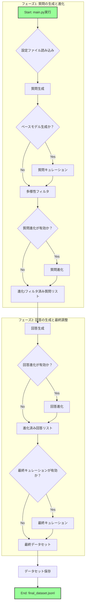

# アーキテクチャ

このドキュメントは、`sdg`リポジトリのデータ生成パイプラインのアーキテクチャを解説します。

## 処理フロー概要

本システムは、設定ファイル (`settings.yaml`または`settings_ollama.yaml`) に基づいて一連のパイプライン処理を実行し、最終的な対話形式のデータセットを生成します。処理は `main.py` がエントリーポイントとなり、心臓部である `src/funs.py` の `Pipeline` クラスが各ステップを順次実行します。

### 推論バックエンド

このシステムは、以下の2つの推論バックエンドをサポートしており、設定ファイルの `inference_backend` キーで切り替えることができます。

1.  **vLLM (`inference_backend: vllm`)**:
    *   NVIDIA GPU環境で高いスループットを実現するバックエンドです。
    *   スクリプト内でモデルのロード・アンロードとGPUメモリの解放を直接制御します。
    *   パワーユーザーや、大規模なデータ生成を高速に行いたい場合に適しています。

2.  **Ollama (`inference_backend: ollama`)**:
    *   Ollamaサーバーを介して推論を行うバックエンドです。
    *   CPUを含む、より幅広い環境で動作します。
    *   セットアップが比較的容易で、手軽に試したい場合に適しています。事前にOllamaサーバーを起動し、使用するモデルを `ollama pull` しておく必要があります。

### Mermaid フローチャート

### 各ステップの詳細

**質問生成 (Generate Questions)**
*   `settings.yaml` の `Seed_generation_method` に応じて「ベースモデル」または「指示応答モデル」をロードします。
*   日本語のランダムな名詞をプロンプトに含めることで、多様な初期質問を生成します。
*   生成された質問は重複が除去されます。

**質問キュレーション (Curate Questions)**
*   `Seed_generation_method` が `base` の場合にのみ実行されます。
*   指示応答モデルを使用し、生成された質問が適切かどうかを「yes/no」形式で判断し、不適切なものをフィルタリングします。

**多様性フィルタ (Diversity Filter)**
*   `sentence-transformers` (E5モデル) を使用して、各質問文をベクトル化します。
*   コサイン類似度を計算し、意味的に似すぎている質問を除去することで、データセット全体の多様性を高めます。
*   `Data_retention_rate_after_diversity_cut` で、フィルタ後に残すデータの割合を指定できます。

**質問進化 (Evolve Questions)**
*   `Prompt_evolution` が `True` の場合に実行されます。
*   `prompts/evo_question_prompt.txt` をテンプレートとして、既存の質問をより複雑、高品質、または異なる言い回しに書き換えるようモデルに指示します。
*   この処理を `Prompt_evolution_times` で指定された回数繰り返すことができます。

**回答生成 (Generate Answers)**
*   ステップ1〜4で準備された質問リストに対して、モデルが回答を生成します。
*   `Using_think_models_for_answer` が `True` の場合、「思考プロセスモデル」を使用し、思考の過程（think）と最終的な回答（answer）を分離して生成します。

**回答進化 (Evolve Answers)**
*   `Answer_evolution` が `True` の場合に実行されます。
*   質問の進化と同様に、`prompts/evo_answer_prompt.txt` を用いて、生成された回答をより洗練されたものに書き換えます。

**最終キュレーション (Curate Final)**
*   `Data_curation` が `True` の場合に実行されます。
*   最終的な「質問」と「回答」のペアが、高品質で論理的に一貫しているかをモデルが「yes/no」で判断し、最終的なフィルタリングを行います。

**データセット保存 (Save Dataset)**
*   全ての処理が完了したデータを、標準的な対話形式（`instruction`, `input`, `output`）のJSONLファイルとして `output/final_dataset.jsonl` に保存します。
